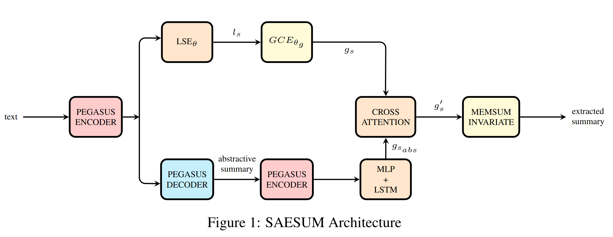

# SAESum: Simultaneous Abstractive and Extractive Summarization.
Over the years, the Natural Language Processing community has witnessed an increasing interest in improving abstractive and extractive text summarization techniques. However, there is still little attention to develop methodologies that solve these tasks simultaneously, even though the objectives are similar from a semantic and conceptual point of view.\\
In this repository, we implement SAESUM, a framework designed to perform extractive and abstractive summarization simultaneously, that attempts to enhance the performance of the former task leveraging the information extracted with the latter.  
  

## How to use this repository
Install the requirements first:  
```bash
pip install -r requirements.txt -q
``` 
To run our experiments:  
__SAESUM Abstractive + Extractive__  
```bash
python src/src/MemSum_Full/train.py -wandb_logger True -two_heads True -pegasus_mode True -training_corpus_file_name src/data/PubMed/train_PUBMED_labelled.jsonl -validation_corpus_file_name src/data/PubMed/val_PUBMED.jsonl -model_folder src/model/MemSum_Full/PubMed/two_heads/ -log_folder src/log/MemSum_Full/PubMed/two_heads/ -vocabulary_file_name src/model/glove/vocabulary_200dim.pkl -pretrained_unigram_embeddings_file_name src/model/glove/unigram_embeddings_200dim.pkl -max_seq_len 100 -max_doc_len 100 -num_of_epochs 10 -save_every 1000 -n_device 1 -batch_size_per_device 1 -max_extracted_sentences_per_document 7 -moving_average_decay 0.999 -p_stop_thres 0.6

```
__SAESUM only Extractive__  
```bash
python src/src/MemSum_Full/train.py -wandb_logger True -two_heads False -pegasus_mode True -training_corpus_file_name src/data/PubMed/train_PUBMED_labelled.jsonl -validation_corpus_file_name src/data/PubMed/val_PUBMED.jsonl -model_folder src/model/MemSum_Full/PubMed/one_head/ -log_folder src/log/MemSum_Full/PubMed/one_head/ -vocabulary_file_name src/model/glove/vocabulary_200dim.pkl -pretrained_unigram_embeddings_file_name src/model/glove/unigram_embeddings_200dim.pkl -max_seq_len 100 -max_doc_len 100 -num_of_epochs 10 -save_every 1000 -n_device 1 -batch_size_per_device 1 -max_extracted_sentences_per_document 7 -moving_average_decay 0.999 -p_stop_thres 0.6

```  
__Vanilla MemSum__  
```bash
python src/src/MemSum_Full/train.py -wandb_logger True -two_heads False -pegasus_mode False -training_corpus_file_name src/data/PubMed/train_PUBMED_labelled.jsonl -validation_corpus_file_name src/data/PubMed/val_PUBMED.jsonl -model_folder src/model/MemSum_Full/PubMed/memsum/ -log_folder src/log/MemSum_Full/PubMed/memsum/ -vocabulary_file_name src/model/glove/vocabulary_200dim.pkl -pretrained_unigram_embeddings_file_name src/model/glove/unigram_embeddings_200dim.pkl -max_seq_len 100 -max_doc_len 100 -num_of_epochs 10 -save_every 1000 -n_device 1 -batch_size_per_device 1 -max_extracted_sentences_per_document 7 -moving_average_decay 0.999 -p_stop_thres 0.6

```  
The name of the relative paths suggest how they file should be organized in order to make everything work.  
Download the models and the processed data from this drive:  
* models download:  
* data download:  

### How this repository is organized  
This repository is built upon the original repository of MemSum, so as to repeat fairly their experiments and setting our framework properly.  
Our contributions are in the following files:  
* evaluation.ipynb: Evaluate on test set the trained models;  
* preprocessing.ipynb: Clean the abstractive dataset and match it with the extractive;  
* proposal_presentation.pptx: Preliminary presentation of our work;  
* src/src/MemSum_Full/datautils.py: Transformer tokenization;  
* src/src/MemSum_Full/train.py: Transformer model and data loading;  
* src/src/MemSum_Full/innovation_block.py: Abstractive summarization of SAESUM;  
* src/src/MemSum_Full/model.py: Modification of the Local Sentence Encoder (LSE);  
* src/summarizers.py: Inserted test inference for one_head and two_heads models;  
* src/training_utils.py: WANDB utilities and set seed for reproducibility;  
* summaries/: Here are contained the summaries also referred to in the report.  
To eval the models on test open the `evaluation.ipynb`.  


### Project Contributors
* Andrea Giuseppe Di Francesco, 1836928
* Antonio Scardino, 2020613

